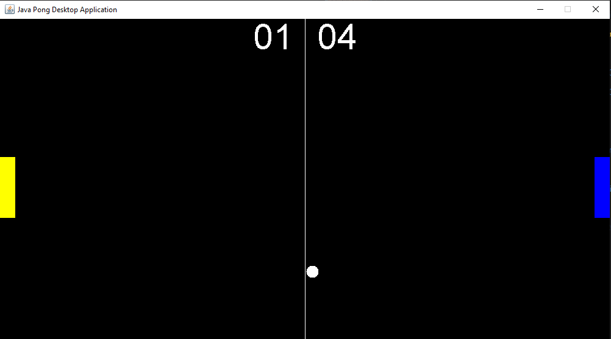

</a>

# Java Pong Desktop Application

# Table of Contents

- [Java Pong Desktop Application](#java-pong-desktop-application)
- [Table of Contents](#table-of-contents)
- [Screenshot of the Application](#screenshot-of-the-application)
- [Description](#description)
- [Instructions](#instructions)
- [Packages used within the Application](#packages-used-within-the-application)
- [System requirements](#system-requirements)
- [Source Code](#source-code)
- [Running the application as an executable](#running-the-application-as-an-executable)

---

# Screenshot of the Application

 

# Description

GUI Java Pong Desktop Application built using awt, event, swing and Jframe interfaces implementing threading and KeyEvents.

The application is wrapped as an executable application (.exe) using Launch4j and ready to go.

# Instructions

- Control left paddle with W | D Keys
- Control Right paddle with Up | Down Keys

# Packages used within the Application

- import java.awt
- import javax.swing.JFrame
- import java.awt.event
- import java.util

# System requirements

- JavaSE-1.8 or higher.

# Source Code

The project was developed in Eclipse IDE and all source code and projects are uploaded as an Eclipse project for convenience.

- Source code is available to view in the src folder
- Compiled code located in the bin directory.
- Jar File
- Executable (.exe) File
- Doc's file (javadocs)

# Running the application as an executable

As the project has already been compiled into an executable file, all you need to is:

- download the project and run Java-Pong-Desktop-Application.exe
- all other files are not required unless you wish to inspect the source code.
